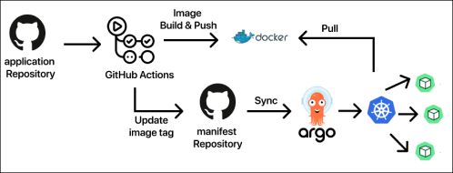

# PortfoGram Manifest Repository

PortfoGram의 Manifest Repository입니다.

## 프로젝트 소개

PortfoGram은 개발자들이 포트폴리오를 공유하고, 다른 개발자들과 소통하며 인맥을 넓힐 수 있는 플랫폼입니다. 이 레포지토리는 PortfoGram의 Kubernetes Manifest를 관리합니다.

## 주요 기능

- Kubernetes 환경에서의 PortfoGram 배포
- PortfoGram 서비스에 필요한 모든 Kubernetes 리소스 정의
- Kubernetes 클러스터 구축 및 배포 자동화
- CI/CD 파이프라인 개선 및 GitOps 기반 배포 자동화
- Application Repository와 Manifest Repository를 분리
- 빌드 및 배포 결과를 GitHub Actions 이용하여 Manifest Repository에 반영
- ArgoCD가 Manifest Repository의 변경사항을 감지하고 Kubernetes 클러스터에 자동 반영
  
## 레포지토리 구조 및 설명

```
.
├── README.md
├── apps
│   ├── monitoring
│   │   ├── base
│   │   │   ├── grafana
│   │   │   ├── loki
│   │   │   ├── prometheus
│   │   │   ├── promtail
│   │   │   ├── tempo
|   |   |   ├── otel
│   │   │   └── thanos
│   │   └── overlays
│   │       └── dev
│   ├── redis
│   │   ├── base
│   │   └── overlays
│   │       └── dev
│   └── spring-boot
│       ├── Chart.yaml
│       ├── templates
│       ├── values-dev.yaml
│       └── values-prod.yaml
├── argocd
│   ├── app-of-apps.yaml
│   └── applications
│       ├── monitoring.yaml
│       ├── redis.yaml
│       └── spring-boot.yaml
└── kustomization.yaml
```

- `apps/`: 각 애플리케이션의 Kubernetes 매니페스트 파일들을 포함합니다.
  - `monitoring/`: 모니터링 스택 (Grafana, Loki, Prometheus, Promtail, Tempo, Thanos,Otel)의 매니페스트
  - `redis/`: Redis 서비스의 매니페스트
  - `spring-boot/`: Spring Boot 애플리케이션의 Helm 차트
- `argocd/`: ArgoCD 관련 설정 파일들
  - `app-of-apps.yaml`: 전체 애플리케이션을 관리하는 ArgoCD Application
  - `applications/`: 각 개별 애플리케이션의 ArgoCD Application 정의
- `kustomization.yaml`: 루트 레벨의 Kustomize 설정 파일

## CI/CD 파이프라인

1. 개발자가 Application Repository에 코드를 push합니다.
2. GitHub Actions가 트리거되어 코드를 빌드하고 테스트합니다.
3. 테스트가 성공하면, 새로운 이미지가 생성되고 레지스트리에 push됩니다.
4. GitHub Actions가 Manifest Repository의 값을 업데이트합니다 (예: 새 이미지 태그).
5. ArgoCD가 Manifest Repository의 변경사항을 감지하고 Kubernetes 클러스터에 자동으로 반영합니다.

## 참고

이 레포지토리는 PortfoGram의 Manifest Repository입니다. Application Repository는 [여기](https://github.com/minina0407/PortfoGram-k8s.git) 에서 확인할 수 있습니다.
